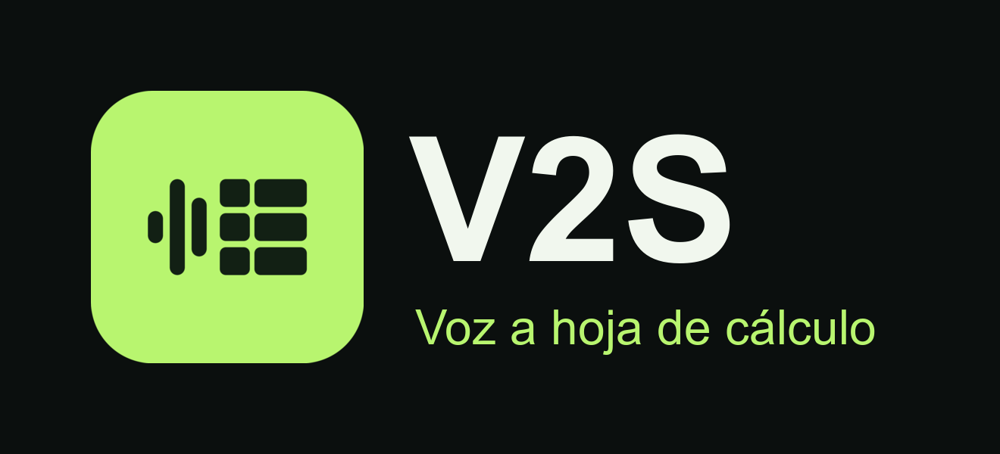

# V2S

Habla o escribe, y el teléfono lo convierte en una hoja de cálculo. Cada grabación o texto crea una hoja nueva con sus propias columnas, o agrega filas a una hoja que ya guardaste. Las hojas viven en la app, como en un Drive pequeño, y se exportan a Google Sheets con un toque. Toda la inteligencia artificial corre en el teléfono con el SDK de QVAC. Lo que dices no sale del dispositivo.

La app tiene dos modos que se ven igual, **Finanzas** y **Salud**. Lo único que cambia es el modelo y las reglas que lo guían. Por eso sirve para un compañero de ahorro, para el registro de equipos médicos de un hospital o para cualquier otra cosa que quieras convertir en filas.

Tracks: Desafío General, Reto Caja de Ahorros, Reto Philips (Inteligencia de Base Instalada de Clientes) y Reto Tether QVAC Psy.

## Cómo funciona

1. Elige el modo con el selector de arriba.
2. Escribe en el cuadro o toca el micrófono. Parakeet transcribe en el teléfono y deja el texto en el cuadro, donde puedes corregirlo.
3. Elige el destino: **Nueva hoja** o una de tus hojas guardadas.
4. Toca **Crear hoja** o **Agregar a la hoja**. La app guarda tu texto antes de procesarlo.
5. El modelo del modo propone título, columnas y filas para una hoja nueva, o filas con las columnas de la hoja elegida.
6. La app verifica cada número contra tu texto y marca con **Revisar** las celdas que no pudo respaldar.
7. Edita celdas, renombra la hoja y toca **Exportar a Google Sheets**.

## Modos

| Modo | Modelo (constante de `@qvac/sdk`) | Cuantización | Tamaño | Reglas del arnés |
| --- | --- | --- | --- | --- |
| Finanzas | Qwen3 1.7B Instruct (`QWEN3_1_7B_INST_Q4`) | Q4 | 1.06 GB | Sugiere columnas de dinero (fecha, concepto, tipo, categoría, monto, método), montos como números |
| Salud | MedPsy 1.7B (`HEALTHCARE_1_7B_MEDICAL_Q4_K_M`) | Q4_K_M | 1.28 GB | Vocabulario clínico y de equipos médicos; nunca agrega diagnósticos, dosis ni valores que no se dijeron |
| Voz a texto (ambos) | Parakeet TDT 0.6B v3 (`PARAKEET_TDT_0_6B_V3_Q4_0`) | Q4_0 | 399 MB | |

Los dos arneses comparten las mismas reglas base: una fila por cosa dicha, celdas vacías cuando falta un dato, nunca inventar números, fechas AAAA-MM-DD, un ejemplo resuelto y salida restringida por JSON Schema. La app carga solo el modelo del modo abierto.

## Hojas generadas de verdad

Estas hojas salieron de los modelos reales en la corrida de evaluación (`eval/runs/`), sin editar. Nadie definió las columnas. Incluimos los errores que cometió el modelo, porque la app está hecha para que los veas y los corrijas.

### Finanzas (Qwen3 1.7B)

Texto: "Ayer compré útiles escolares por 38.50 y el taxi fue 6."

Hoja generada: **Movimientos**

| Fecha | Concepto | Tipo | Categoría | Monto | Método |
| --- | --- | --- | --- | --- | --- |
| 2026-09-09 | Útiles escolares | Gasto | Educación | 38.5 | Tarjeta |
| 2026-09-09 | Taxi | Gasto | Transporte | 6 | Tarjeta |

"Ayer" se convirtió en la fecha correcta y las categorías son las esperadas. El método "Tarjeta" no se dijo: el modelo lo inventó. Por eso cada celda se edita antes de exportar.

### Salud (MedPsy 1.7B)

Texto: "Centro de Imágenes Diagnósticas en Guatemala. Tienen un tomógrafo Siemens Somatom de unos seis años y un equipo de rayos X Fujifilm."

Hoja generada: **Centro de Imágenes Diagnósticas en Guat**

| Cliente | Modalidad | Cantidad | Marca | Antigüedad | Estado |
| --- | --- | --- | --- | --- | --- |
| Centro de Imágenes Diagnósticas en Guat | Tomografía | 1 | Siemens | 6 | Estimado |
| Centro de Imágenes Diagnósticas en Guat | Radiografía | 1 | Fujifilm | 1 | Estimado |

Modalidad, marca y estado "Estimado" (por "unos seis años") son correctos. El nombre del cliente quedó cortado por el límite de largo del campo, y la antigüedad "1" del equipo de rayos X no se dijo, así que la app la marca para revisar.

## Evidencia

### Calidad medida

`scripts/eval-sheets.ts` corre el mismo arnés que usa la app (llamada de lista, llamada de filas y ensamblado) sobre casos sintéticos con respuesta esperada. Como las columnas son libres, busca cada dato esperado en cualquier celda de la hoja.

| Métrica | Finanzas, Qwen3 (10 casos) | Salud/equipos, MedPsy (12 casos) |
| --- | --- | --- |
| Recall de filas (mediana) | 100 % | 100 % |
| Filas generadas / esperadas | 16 / 15 | 17 / 19 |
| Datos clave encontrados | 91.2 % (31/34) | 59.2 % (29/49) |
| Números respaldados por el texto, salida cruda del modelo | 100 % | 75.9 % |
| Números respaldados por el texto, tras el ensamblado | 100 % | 94.1 % |

El salto de 75.9 % a 94.1 % en Salud es el trabajo de la verificación: MedPsy inventa números, y la app los descarta o los marca antes de guardarlos. Detalle por caso, prompts y salidas crudas: `eval/runs/*.jsonl`. Explicación de cada métrica: `eval/runs/*.md`.

```sh
bun scripts/eval-sheets.ts --mode finanzas --set finanzas
bun scripts/eval-sheets.ts --mode salud --set equipos
```

### Por qué este arnés

Probamos tres diseños sobre los dos modelos (`eval/probe/sheet-probe*.mjs` y sus resultados). Una sola llamada omitía los últimos elementos dichos. Pedir la lista y las filas en la misma respuesta seguía omitiendo. Separar una llamada que lista cada cosa dicha y otra que genera exactamente esa cantidad de filas encontró todos los elementos; el ensamblado quita duplicados y filas sin respaldo en el texto.

### Por qué Parakeet

Sintetizamos una consulta de 48 segundos con dos voces (Supertonic 3 de QVAC) y la transcribimos con los dos modelos de voz para español:

| Modelo | Error por palabra | Tiempo de transcripción |
| --- | --- | --- |
| Parakeet TDT 0.6B v3 Q4_0 | 0.22 | 6.7 s |
| Whisper Tiny español Q8_0 | 0.50 | 1.1 s |

Whisper omitió la mitad del audio. Script, audio y resultados: `eval/probe/asr-probe.mjs`, `eval/probe/consulta-16k.wav`, `eval/probe/asr-results.jsonl`.

### Por qué Qwen3 en Finanzas y MedPsy en Salud

Sobre frases de dinero, MedPsy omitió movimientos e inventó una fila, y Qwen3 encontró todos (`eval/probe/finance-results.jsonl`). Sobre frases de equipos médicos, Llama 3.2 1B escribió "visto" como nombre del cliente, y MedPsy identificó hospital, ciudad y país (`eval/probe/results.jsonl`). Cada modo usa el modelo que mejor resolvió su tipo de texto.

Salud cubre dos tipos de texto: equipos médicos y consultas clínicas. Corrimos los dos conjuntos con los dos modelos para decidir cuál se queda:

| Recall de valores clave | MedPsy | Qwen3 |
| --- | --- | --- |
| Equipos médicos (12 casos) | 59.2 % | 83.7 % |
| Consultas clínicas (10 casos) | 47.2 % | 28.3 % |

Qwen3 gana en equipos, un texto descriptivo sin vocabulario médico especializado. MedPsy gana claramente en consultas, donde hay identidad del paciente, signos vitales y medicamentos con dosis, el vocabulario para el que se entrenó. Salud se queda con MedPsy: gana la mitad más difícil de su rango, y el reto QVAC Psy exige un modelo Psy en el flujo principal. Datos completos: `eval/runs/equipos-*` y `eval/runs/consultations-*`.

## Exportar a Google Sheets

El botón **Exportar a Google Sheets** comparte `<nombre de la hoja>.csv` por el menú de Android. Elige Google Drive y ábrelo con Sheets. El CSV usa UTF-8 con BOM y comillas según RFC 4180, así que acentos y celdas con comas llegan intactos.

## Rendimiento

La app escribe `perf-log.jsonl` en el teléfono con cada carga de modelo, transcripción y generación: modelo, cuantización, prompt, tokens de entrada y salida, TTFT, tokens por segundo, backend y dispositivo. Para exportarlo, toca **En el dispositivo** y luego **Compartir registro de rendimiento**.

Referencia de escritorio, de las corridas de evaluación (Intel Core Ultra 7 258V, 8 núcleos, 16 GB, WSL2, backend CPU, sin GPU):

| Paso | Finanzas, Qwen3 | Salud, MedPsy |
| --- | --- | --- |
| Carga del modelo (desde caché) | 5.0 s | 5.4 s |
| Llamada de lista: TTFT mediano | 1.4 s | 1.5 s |
| Llamada de lista: velocidad mediana | 30.9 tok/s | 27.2 tok/s |
| Llamada de filas: TTFT mediano | 2.8 s | 2.6 s |
| Llamada de filas: velocidad mediana | 27.9 tok/s | 22.4 tok/s |
| Total por envío: mediana (p90) | 8.4 s (12.2 s) | 14.6 s (28.6 s) |

## Sin nube

- Toda la inferencia corre con `@qvac/sdk` en el dispositivo. No hay llamadas a APIs remotas.
- La única conexión de red es la primera descarga de modelos desde el registro de QVAC, que usa Hyperswarm (P2P).
- Las hojas se guardan en archivos JSON dentro del almacenamiento privado de la app.

## Descargar e instalar

Descarga el APK más reciente, generado automáticamente desde `main`:

**https://github.com/tapilew/v2s/releases/latest/download/v2s.apk**

1. Abre el enlace en un teléfono Android arm64 con Android 10 (API 29) o superior y unos 3 GB libres.
2. Abre el archivo descargado y permite instalar apps de esa fuente cuando Android lo pida.
3. Abre V2S con conexión a internet. La primera vez que uses cada modo, la app descarga su modelo.
4. Después de descargar los dos modelos, la app funciona en modo avión.

El APK está firmado con la clave de depuración de la plantilla de Expo: sirve para instalar a mano, no para la Play Store. El flujo `.github/workflows/android-apk.yml` lo construye y lo publica en cada push a `main`.

## Ejecutar en Android

QVAC publica binarios nativos solo para `arm64-v8a`. Un emulador x86_64 no puede cargar los modelos. La demo real necesita un teléfono Android arm64 con Android 10 (API 29) o superior y unos 3 GB libres.

```sh
bun install
npx expo prebuild
npx expo run:android --device
```

La primera vez que abres cada modo, la app descarga su modelo. Después funciona en modo avión.

Interfaz sola en un emulador, sin modelos, con respuestas de demostración:

```sh
EXPO_PUBLIC_UI_ONLY=true bun run android
```

Pruebas: `bun test src` y `bunx tsc --noEmit`.

## Limitaciones

- Solo probamos español.
- Los casos de evaluación son sintéticos. No usamos datos reales de clientes bancarios, pacientes ni hospitales.
- En las corridas, Qwen3 a veces inventó métodos de pago o tomó un ingreso como gasto, y MedPsy a veces confundió modalidades, unió dos equipos en una fila o inventó un estado. La verificación marca los números sin respaldo, pero no detecta una categoría o una modalidad equivocada.
- El modelo puede omitir datos o elegir columnas distintas a las que esperabas. Cada fila guarda el texto original y las celdas se editan.
- Las cifras de escritorio no son las del teléfono. Las del teléfono salen del registro de rendimiento.

## Base preexistente

Declarada según las reglas del hackathon.

- Plantilla de `create-expo-app` en TypeScript: `app.json`, `index.ts`, configuración de Babel, Metro, Tailwind y NativeWind, y la licencia MIT de 650 Industries. Las imágenes originales de la plantilla quedan en `assets/brand/expo-template-originals`.
- El commit inicial `69d733d` (un asistente de voz con Whisper y Llama 3.2 1B, y los scripts `scripts/launch-android.ts` y `scripts/verify-android.ts`) lo generamos con asistentes de IA durante el hackathon, sobre la plantilla de Expo y siguiendo la documentación del SDK de QVAC.
- `.claude/skills/`, `.agents/skills/` y `skills-lock.json`, skills de terceros para asistentes de programación. No forman parte de la app.
- Usamos asistentes de programación con IA (Codex y Claude Code), que las reglas permiten.

El historial muestra cómo evolucionó la idea durante las 48 horas: voz a hoja de cálculo, plantillas fijas por modo y, al final, hojas libres con biblioteca.

## Componentes de terceros

| Componente | Licencia | Uso |
| --- | --- | --- |
| `@qvac/sdk` | Apache-2.0 | Carga de modelos, transcripción y generación en el dispositivo |
| Expo y React Native | MIT | App móvil |
| `expo-audio` | MIT | Grabación del micrófono |
| `expo-file-system` | MIT | Almacenamiento local |
| `expo-sharing` | MIT | Exportar CSV y el registro de rendimiento |
| `expo-device` | MIT | Nombre del dispositivo en el registro de rendimiento |
| NativeWind y Tailwind CSS | MIT | Estilos |

No hay APIs remotas.

## Licencia

MIT. Ver `LICENSE`.
